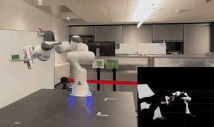

# STORM
**Stochastic Tensor Optimization for Robot Motion** - *A GPU Robot Motion Toolkit*

[[Install Instructions](install_instructions.md)] [[Paper](https://arxiv.org/abs/2104.13542)] [[Website](https://sites.google.com/view/manipulation-mpc/home)]

This package contains code for reactive robot motion leveraging parallel compute on the GPU. The implemented control framework leverages MPPI to optimize over sampled actions and their costs. The costs are computed by rolling out the forward model from the current state with the sampled actions. Most files are documented with sphinx. Once you clone this repo, go into docs folder and run `sh generate_docs.sh` to generate documentation.

**To run on a real Franka Panda, you can use this low-level control wrapper:** [franka_motion_control](https://github.com/mohakbhardwaj/franka_motion_control) from [Mohak Bhardwaj](https://github.com/mohakbhardwaj).
<p align="center">
  
  
</p>


## Updates
Jan. 2022 - Add CoRL citation, merge torch.size() bug (thanks [@maxpahn](https://github.com/maxspahn)).

## Contributors
- Mohak Bhardwaj
- Balakumar Sundaralingam

## Citation
If you use this source code, please cite the below article,

```
@article{storm2021,
  title={{STORM}: An Integrated Framework for Fast Joint-Space Model-Predictive Control for Reactive Manipulation},
  author={Mohak Bhardwaj and Balakumar Sundaralingam and Arsalan Mousavian and Nathan D. Ratliff and Dieter Fox and Fabio Ramos and Byron Boots},
  booktitle={5th Annual Conference on Robot Learning },
  year={2021},}
```

## Contributing to this code
Refer to CLA before making contributions.
