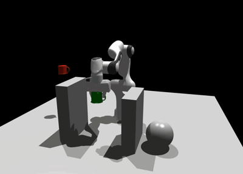
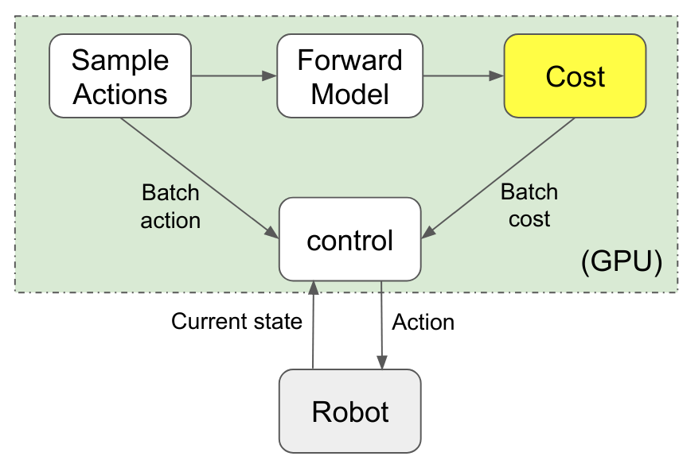

.. storm documentation master file, created by
   sphinx-quickstart on Wed Dec  2 09:22:22 2020.
   You can adapt this file completely to your liking, but it should at least
   contain the root `toctree` directive.

STORM
=====
   
**Stochastic Tensor Optimization for Robot Motion** - *A GPU Robot Motion Toolkit*

This package contains code for reactive robot motion leveraging parallel compute on the GPU.

The proposed control framework leverages MPPI ("control" block in below image) to optimize over sampled actions and their costs. The costs are computed by rolling out the forward model from the current state with the sampled actions.

.. mdinclude:: ../install_instructions.md
.. include:: storm_kit.rst

Indices and tables
==================

* :ref:`genindex`
* :ref:`modindex`
* :ref:`search`
